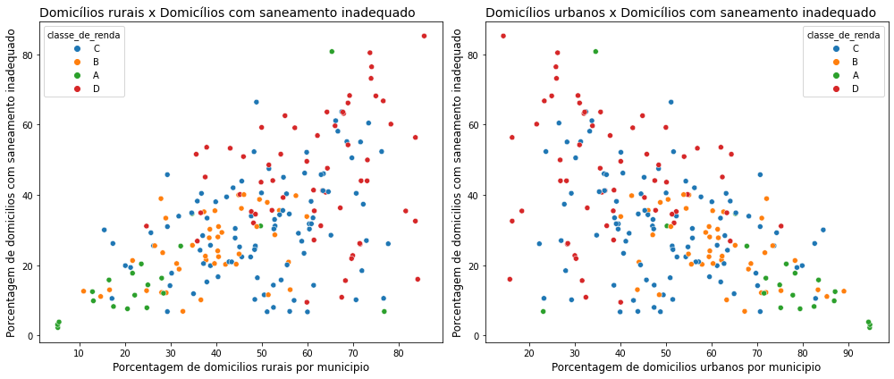
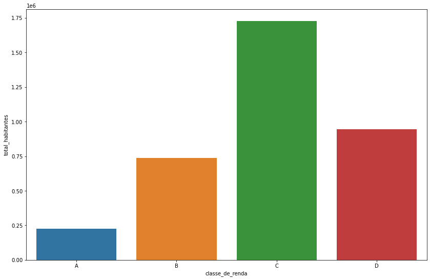

# Desafio 2 - Trilha de ciência de dados - Inova Maranhão.

# Análise de dados sobre saneamento básico no estado do Maranhão

## Objetivo:

Fazer tratamento de dados e apresentar possiveis relações entre dados de diferentes tabelas que apresentem causas da deficiência na questão de saneamento básico no estado do maranhão.

## Dados recebidos:
Foi recebido como dados para realizar a analise, 17 tabelas no formato xls, esses dados foram obtidos do Censo Demográfico de 2010, realizado pelo IBGE.   

## Bibliotecas utilizadas

* <a href="https://pandas.pydata.org">Pandas</a>
* <a href="https://numpy.org">Numpy</a>
* <a href="https://matplotlib.org/stable/api/_as_gen/matplotlib.pyplot.html">Matplotlyb.pyplot</a>
* <a href="https://matplotlib.org/stable/api/_as_gen/matplotlib.pyplot.html">Seaborn</a>

## Caminho para solução:

- Observação do conteúdo de cada uma das 17 tabelas para identificar relações (trabalho realizado fora do notebook).
* Escolha das tabelas que possam ter maior relacionamento para desenvolvimento da solução. As tabelas escolhidas foram as tabelas:
    
    1. Tabela 1 - Dados sobre população residente, total e respectiva distribuição percentual, por situação do domicílio e sexo, e razão de sexo, segundo os municípios.

    2. Tabela 7 - Dados sobre domicílios particulares permanentes, total e respectiva distribuição percentual, por situação do domicílio e tipo de saneamento, segundo os municípios.

    3. Tabela 8 - Dados sobre valor médio e quartis do rendimento mensal total domiciliar per capita nominal, por situação do domicílio, segundo os municípios. Nesta tabela foi adicionada uma nova coluna, chamada classe de renda, onde foi definido intervalos de da renda media por domicilio e organizado dos menos para os maiores em ordem alfabética decrescente de D a A.

 

- Limpeza e tratamento dos dados dessas tabelas que foram escolhidas.  
* Cada tabela escolhida foi trabalhada em um notebook individual e ao final do tratamento foi gerado um arquivo csv para uso destes dados limpos. 
- Análise dos dados que foram tratados a partir dos arquivos csv obtidos.

## Tratamentos realizados

* Remoção de dados nulos
    * Linhas totalmente nulas
    * Linhas parcialmente nulas, porém com dados que não são relevantes para a análise

* Criação de novas colunas 
    * Para a tabela 8, foi criada uma nova coluna de dados categóricos, onde foi separado a renda média por domicílio em classes utilizando a regra de sturges para definir o número de classes, e depois esse número de classes foi diminuido para quatro já que tinha muitas classes com poucos valores. Mais detalhes desse processo pode ser visto no notebook desafio2_tab8.

* Substituição de valores
    * Em algumas colunas das tabelas analisadas a porcentagem de 0% era representada por -, isso foi substituido pelo valor zero para que seja possivel a exibição em gráficos.

* Remoção de Outliers
    * No notebook de análise, para análisar o total da população em uma relação, foi necessário fazer uma remoção de alguns pontos fora da curva, de forma que a análise não seja afetada por estes pontos.

* Exportando dados utilizando pandas

## Alguns gráficos criados utilizando seaborn:

Para entender melhor esses gráficos, recomendo olhar o notebook desafio2_analise.

**Relação entre domicílio rural ou urbano e saneamento inadequado**
 

**Intervalos da renda média por domicilio definido em classes relacionado com o total de habitantes**
 

